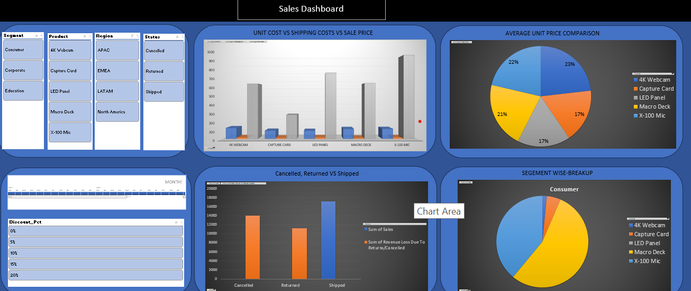

# Sales & Revenue Performance Analytics Dashboard (Excel)

## 📌 Project Overview
An interactive, end-to-end Sales & Revenue Analytics Dashboard built in Microsoft Excel. This project analyzes e-commerce transactional data across sales regions, customer segments, and product categories to track key performance indicators (KPIs) and quantify revenue loss from order cancellations and returns.

---

## 📸 Dashboard Preview

---

## 🔑 Key Features & Technical Highlights
* **Dynamic KPI Tracking:** Built summary cards tracking Total Revenue, Net Profit Margin, Order Volume, and Return Rates.
* **Interactive Slicers:** Implemented multi-field slicers to filter performance dynamically by region, quarter, and product category.
* **Data Modeling & Pivot Tables:** Modeled raw transactional data into structured pivot tables to isolate sales trends and regional profitability drivers.
* **Revenue Loss Analysis:** Quantified financial leakage stemming from canceled orders and product returns to highlight operational improvement areas.

---

## 📁 Repository Files
* `Sales-Performance-Dashboard.xlsx`: Complete interactive Excel workbook with data models, pivot tables, and visual dashboards.
* `excel-dashboard.png`: Visual preview of the main dashboard interface.
